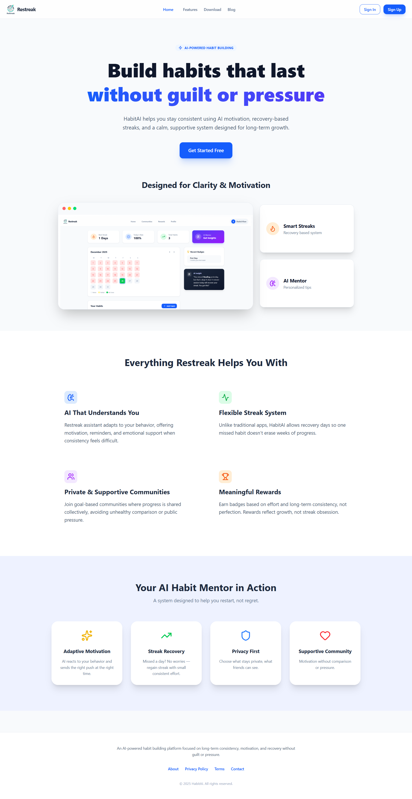
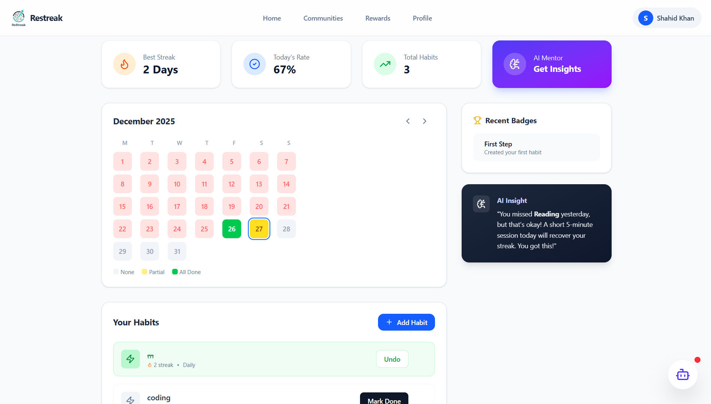
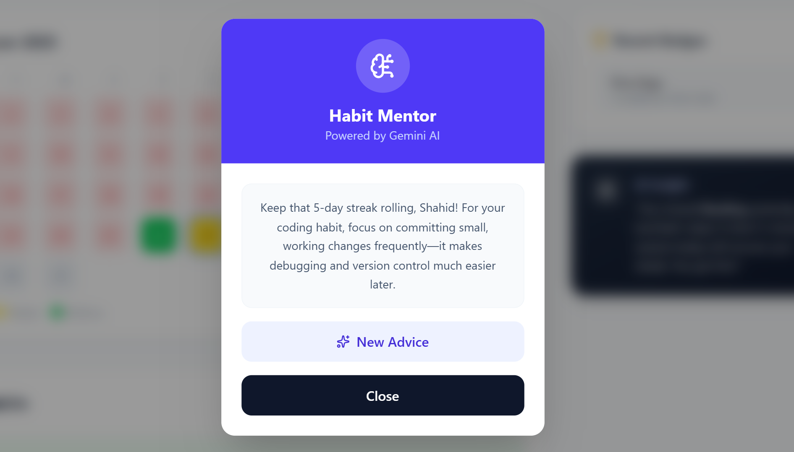
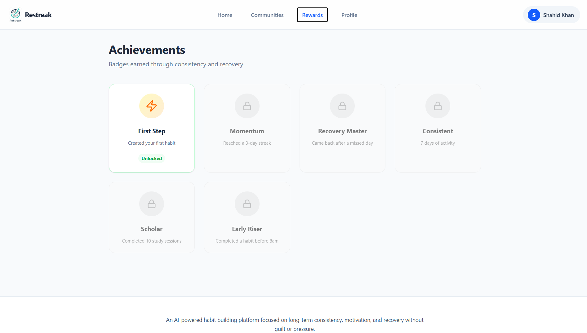

<div align="center">


# ⚡ Restreak
### The AI-Powered Habit Builder

<b>Build habits that stick. No guilt. No pressure. Just progress.</b>  
Powered by <strong>Google Gemini AI</strong> & <strong>Firebase</strong>.

<p align="center">
  <a href="https://restreak-xi.vercel.app" target="_blank">
    
  </a>
</p>

<p align="center">
  
  
  
  
  
</p>

</div>

---

## 📸 Live Preview

<div align="center">
  <a href="https://restreak-xi.vercel.app" target="_blank">
    
  </a>

  <br/><br/>

  <h3>👉 <a href="https://restreak-xi.vercel.app">Click here to try the Live Demo</a> 👈</h3>
</div>

---

## 🧠 Problem Statement

Traditional habit trackers rely on **rigid streaks**.  
Missing a single day resets progress, creates guilt, and demotivates users.

Users don’t need punishment — they need **support, recovery, and guidance**.

---

## 💡 Our Solution

**Restreak** is an AI-powered habit platform that focuses on:

- ✅ **Recovery instead of reset**
- ✅ **Motivation instead of guilt**
- ✅ **Consistency instead of perfection**

AI is not an add-on — **AI is the core experience**.

---

## 📸 Screenshots

<div align="center">

| **Dashboard View** | **AI Mentor Chat** |
|:---:|:---:|
|  |  |
| *Visual Calendar & Daily Stats* | *Context-Aware Advice & Motivation* |

| **Reward System** | **Profile & Analytics** |
|:---:|:---:|
|  |  |
| *Gamified badges based on effort* | *Long-term progress insights* |

</div>

---

## ✨ Key Features

### 🤖 AI Habit Mentor (Gemini)
- Floating AI chatbot accessible from the dashboard
- Context-aware responses based on habits and streaks
- Encouraging, short, actionable guidance  

> *“You missed yesterday — that’s okay. Try a 5-minute session today to recover momentum.”*

---

### 📅 Smart Visual Calendar
Color-coded daily progress for instant clarity:

- 🟩 **Green** → All habits completed  
- 🟨 **Yellow** → Partial completion  
- 🟥 **Red** → Missed  
- ⚪ **Gray** → Future  

---

### 🔥 Recovery-Based Streaks
- Streaks don’t break permanently on the first missed day
- Undo & recovery logic supported
- Focus on long-term behavior change rather than perfection

---

### 🏆 Gamified Rewards
- Earn badges like **First Step**, **Recovery Master**, **Early Riser**
- Rewards unlock dynamically using real-time database data

---

### 👤 Profile & Analytics
- Completion rate tracking
- Total active days
- Recent activity timeline

---

## 🧩 Google Technologies Used

This project is built entirely using Google ecosystem tools:

- **Firebase Authentication**  
  Secure login using Google Sign-In and Email/Password

- **Cloud Firestore**  
  Real-time NoSQL database for habits, streaks, calendar logs, rewards, and profiles

- **Google Gemini API**  
  Powers the AI Habit Mentor for personalized motivation and recovery insights

- **Google Cloud Platform**  
  Infrastructure for scalability, security, and reliability

---

## 🛠️ Tech Stack & Architecture

| Component | Technology | Description |
|:--|:--|:--|
| Frontend | React + Vite | Fast, component-based UI |
| Styling | Tailwind CSS | Responsive utility-first design |
| Icons | Lucide React | Lightweight SVG icon system |
| Backend | Firebase | Firestore DB + Authentication |
| AI Engine | Google Gemini API | AI-powered habit mentoring |

---

## 🚧 MVP Scope

### ✅ Implemented
- Authentication (Google + Email)
- Habit creation & completion
- Smart streak & recovery logic
- AI Mentor integration
- Visual progress calendar
- Rewards & profile analytics

### ⏳ Planned (Post-Hackathon)
- Community interactions
- Social challenges
- Habit sharing & leaderboards

---


## 🚀 Getting Started locally


Follow these steps to run Restreak on your machine.


### Prerequisites
- Node.js (v16 or higher)
- A Firebase Project (Firestore & Auth enabled)
- A Google Cloud API Key (for Gemini)

### Installation

1. **Clone the repository**
   ```bash
   git clone https://github.com/type-ofThings/Restreak
   cd Restreak
   cd frontend
   ```

2.  **Install dependencies**
    ```bash
    npm install
    ```

3.  **Configure Environment Variables**
    Create a `.env` file in the root directory and add your keys:
    ```env
    VITE_FIREBASE_API_KEY=your_firebase_api_key
    VITE_FIREBASE_AUTH_DOMAIN=your_project.firebaseapp.com
    VITE_FIREBASE_PROJECT_ID=your_project_id
    VITE_FIREBASE_STORAGE_BUCKET=your_project.appspot.com
    VITE_FIREBASE_MESSAGING_SENDER_ID=your_sender_id
    VITE_FIREBASE_APP_ID=your_app_id
    VITE_GEMINI_API_KEY=your_google_gemini_api_key
    ```

4.  **Run the development server**
    ```bash
    npm run dev
    ```

5.  Open `http://localhost:5173` in your browser.

---

## 🤖 How the AI Works

The **AI Mentor** utilizes the **Google Gemini API** to provide personalized, context-aware guidance.

It analyzes:
1. Your active habits (e.g., *Coding*, *Running*).
2. Your current streak count.
3. Your habit completion history.

Based on this context, the AI generates short, supportive, and actionable motivational messages.

**Example:**
> *“Great consistency! Since you’re coding daily, try refactoring one small function today to improve code quality.”*

---

## 🔐 Privacy & Ethics

- User data is **private by default**.
- Habits can remain personal without social pressure.
- AI responses are generated **only from habit-related context**, not sensitive personal data.
- No dark patterns, shame-based mechanics, or guilt-driven nudges are used.

---

## 🛡️ License

Distributed under the **MIT License**.  
See the `LICENSE` file for more information.

---

## 👨‍💻 Team & Contact

This project was collaboratively built by a team **Nexora**.

### 👤 Shahid Khan
- **LinkedIn:** https://www.linkedin.com/in/shahidx05  
- **Twitter (X):** https://x.com/shahidx_05  
- **GitHub:** https://github.com/shahidx05  

### 👤 Kunal Sharma
- **Role:** UI / Frontend Design  
- **GitHub:** https://github.com/type-ofThings 

### 👤 Rishit Mehra
- **Role:** Frontend / UI Support  
- **GitHub:** https://github.com/rishit2006mehra

**Project Repository:**  
https://github.com/type-ofThings/Restreak
